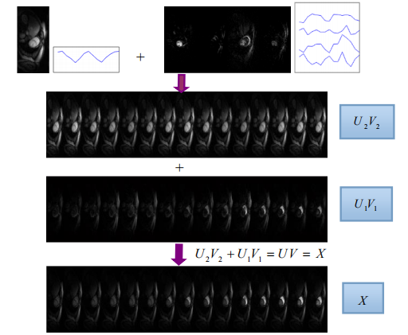

# SDR
Sparse and dense hybrid representation via subspace modeling for dynamic MRI

%   Distribution code Version 1.0 -- 06/22/2015     
%%   The current version is not optimized.   
%   All rights reserved.   
%   This work should only be used for nonprofit purposes.   
%   
%   Please cite the paper when you use th code:   
%   The Code is created based on the method described in the following paper     
%   [1] Q. Liu, S. Wang, D. Liang. Sparse and dense hybrid representation via subspace modeling for dynamic MRI,      
%   Computerized Medical Imaging and Graphics, 56: 24-37, 2017.    
%   Copyright 2015, Nanchang University.    
%   The code and the algorithm are for non-comercial use only.    
%%   the demo produces the results shown in Fig. 14 of the ref.[1].    
% The data phan.mat is available at: https://drive.google.com/drive/folders/0B3EiIvcKNZj8fkplX1JGR21yNjdORkhralp1NGxNb1RTRGFfOWZ0dGthNk5CeVpBV1FWZVE. 

## Visual illustration of the signal characteristics with two-subspace modeling.

 
The dMRI series data is modeled as the sum of a static component and a motion features component under the desired dictionary V.

  

## Other Related Projects
  * Predual dictionary learning (PDL) / augmented Lagrangian multi-scale dictionary learning(ALM-DL) [**[Paper]**](http://www.escience.cn/people/liuqiegen/index.html;jsessionid=5E20FEE3694E8BB3249B64202A8E25C8-n1)   [**[Code]**](https://github.com/yqx7150/PDL_ALM_DL_code) 

  * Adaptive dictionary learning in sparse gradient domain for image recovery [**[Paper]**](https://ieeexplore.ieee.org/document/6578193/)   [**[Code]**](https://github.com/yqx7150/GradDL) 
 
  * Highly undersampled magnetic resonance image reconstruction using two-level Bregman method with dictionary updating [**[Paper]**](https://ieeexplore.ieee.org/document/6492252)   [**[Code]**](https://github.com/yqx7150/TBMDU) 
  
  * Convolutional Sparse Coding in Gradient Domain for MRI Reconstruction [**[Paper]**](http://html.rhhz.net/ZDHXBZWB/html/2017-10-1841.htm)   [**[Code]**](https://github.com/yqx7150/GradCSC)
    
  * Field-of-Experts Filters Guided Tensor Completion [**[Paper]**](https://ieeexplore.ieee.org/document/8291751/similar#similar)   [**[Code]**](https://github.com/yqx7150/FoE_STDC)
  
  * Synthesis-analysis deconvolutional network for compressed sensing [**[Paper]**](https://ieeexplore.ieee.org/document/8296620)   [**[Code]**](https://github.com/yqx7150/SADN)

